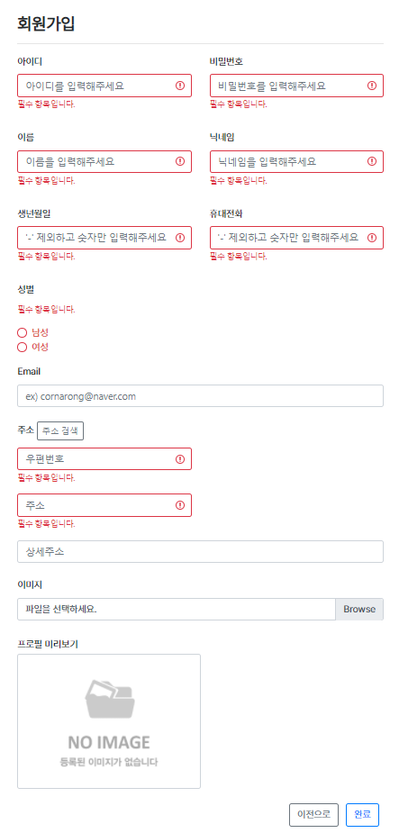
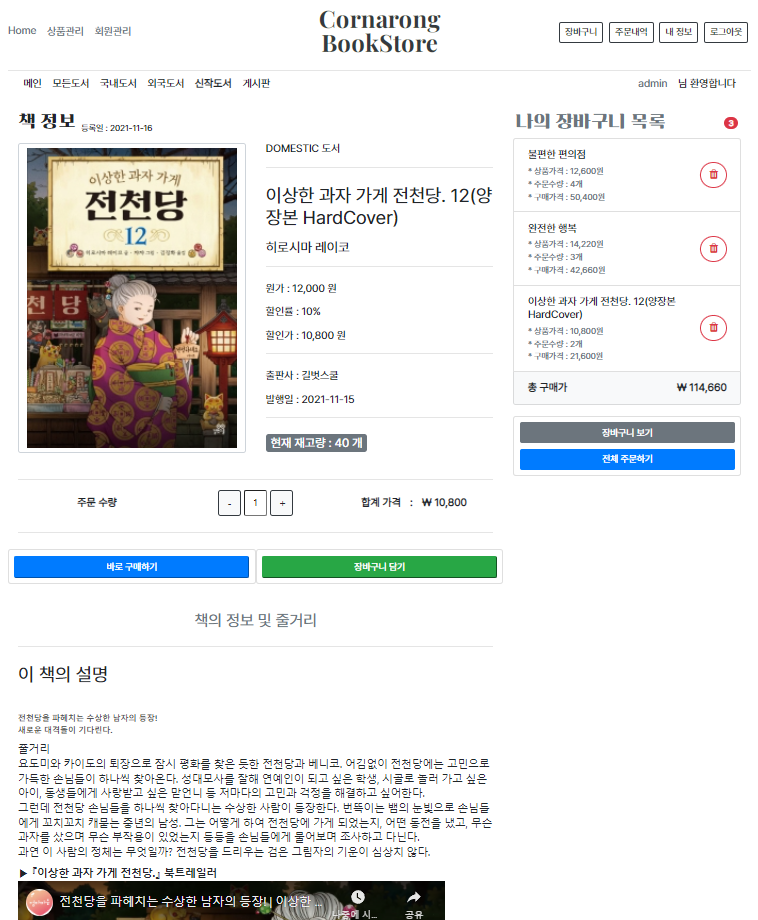
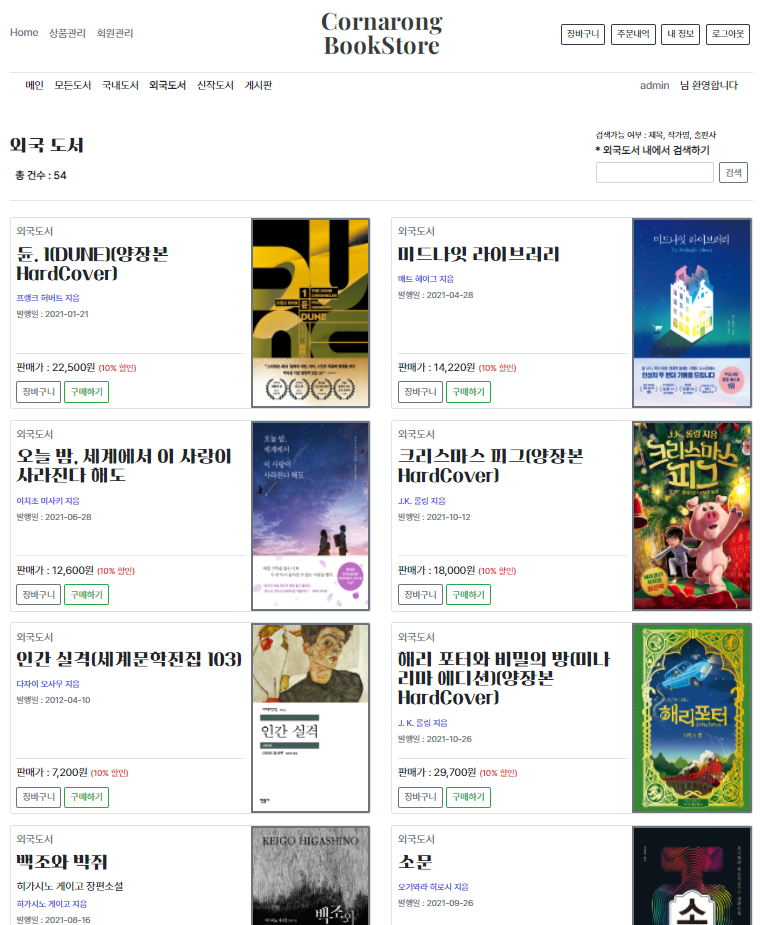
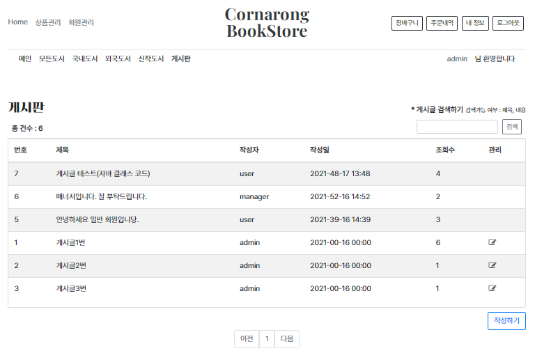
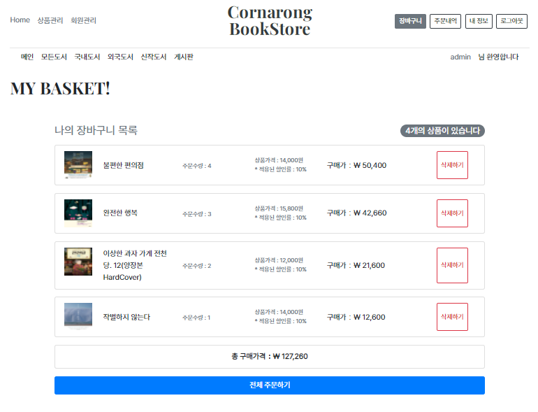
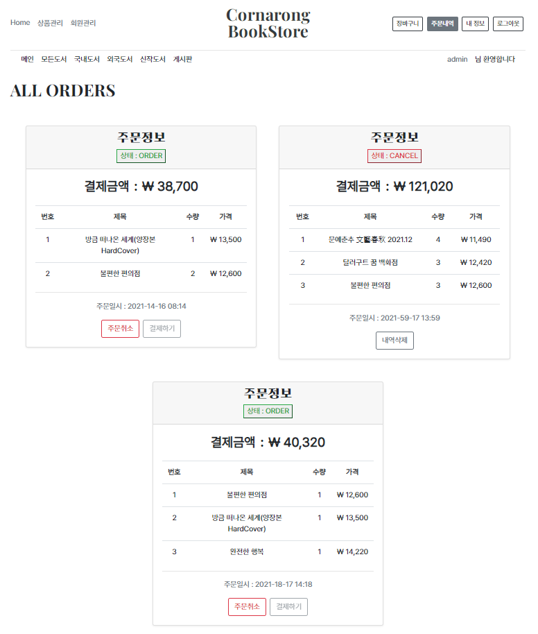
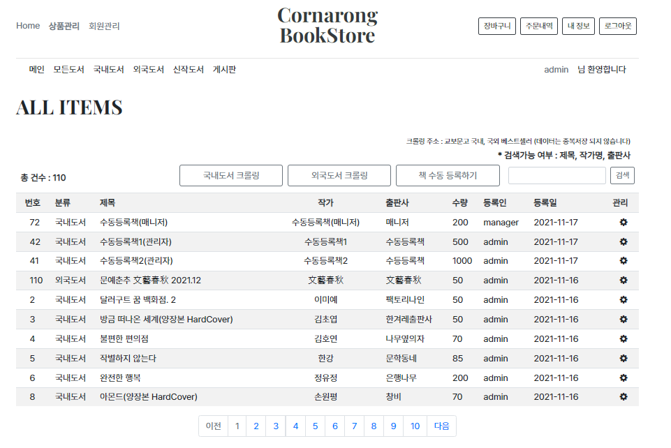
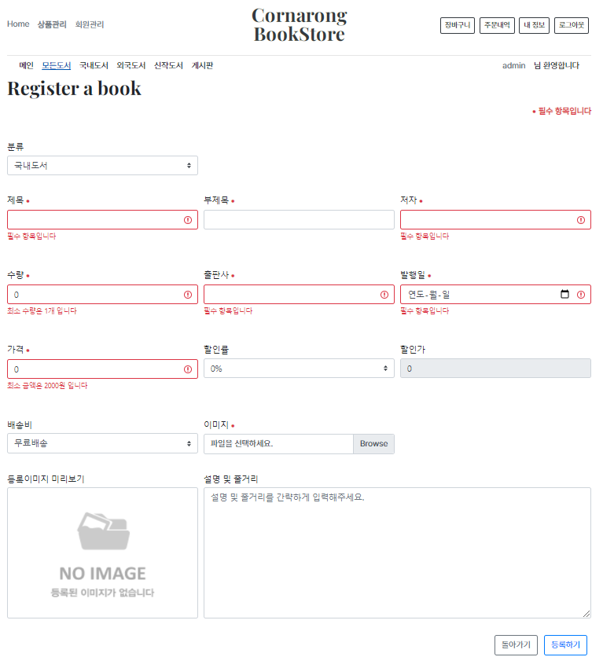
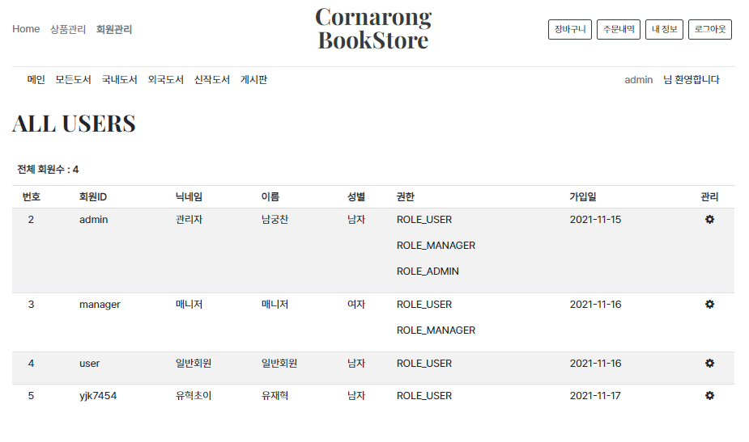
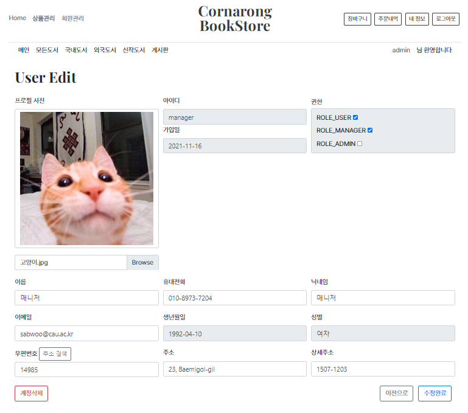

<body>
  <table id="customBar" style="text-align: center">
    <td>
      <a href="#1" style="color: black; font-weight: bold">사용된 기술스택</a>  
    </td>
    <td>
      <a href="#2" style="color: black; font-weight: bold">서비스 설계 구조</a>  
    </td>
    <td>
      <a href="#3" style="color: black; font-weight: bold">프로젝트 기능</a>  
    </td>
    <td>
      <a href="#4" style="color: black; font-weight: bold">권한별 기능</a>  
    </td>
    <td>
      <a href="#5" style="color: black; font-weight: bold">프로젝트 화면</a>  
    </td>
    <td>
      <a href="#6" style="color: black; font-weight: bold">이슈 사항</a>  
    </td>
  </table>
</body>

# Cornarong BookStore
### 인터넷 서점

## * 프로젝트 개발 이유

>최신 기술 트랜드에 따라 평소에 관심있던 기술들을 학습하면서
학습한 내용을 바탕으로 프로젝트에 적용시켜 보고자 하여 만들게 되었습니다.

 
 

<section class="resume-section" id="1">

 
 

## * 사용된 기술 스택

-  
-    
-    
-    
-  

</section>

 
 

<section class="resume-section" id="2">

 
 

## * 서비스 설계 구조

>모든 리소스 자원은 `Spring Security`로 권한에 따라 관리하고 있습니다.
>
>데이터베이스는 `MySQL`을 사용했으며 서비스와 연동 및 매핑은 `Spring Data Jpa`와 `Hibernate`를 사용하였습니다.  
테이블 및 컬럼은 `Hibernate`으로 자동 생성하였고 필요에 따라 수동으로 수정하였습니다.
>
>`Controller`에서는 `DTO`를 사용하여 클라이언트로 응답하거나 `Service`의 인자로 사용하였고   
`Service`에서는 `DTO <-> ENTITY` 변환 처리 및 `Repository`를 사용하여 DB에 접근하고 가공된 데이터를 `DTO`로 변환하여  
`Controller`로 반환하도록 설계하여 `Controller`와 `Service`역할을 명확하게 분담하여 가독성과 유지보수성을 높였습니다.
>
>`ENTITY`의 수정은 데이터의 보안성과 객체의 일관성을 유지하기 위해 `ENTITY`의 내부에서만 가능하도록 설계하였으며  
기본 생성자는 `AccessLevel.PROTECTED`으로 선언하여 무분별한 객체 생성을 방지하였습니다.  
`DTO`는 외부에서도 수정 또는 객체 생성이 가능하지만 유지보수성을 고려하여 `Service`에서 처리하였습니다.
>
>또한 `Service`의 무분별한 비즈니스 로직으로 가독성이 떨어질 것을 고려하여 데이터 가공의 관련된 비즈니스 로직들은  
해당 `ENTITIY` 또는 해당 `DTO`내부에 선언하여 직접 호출하여 사용하도록 설계하였습니다.
>
>서버는 `AWS`에서 지원하는 프리티어 서비스인 `ec2`를 사용하여 빌드 및 배포하였고 파일의 형상관리는 `Git`으로 하고있습니다.

</section>

 
 

<section class="resume-section" id="3">

 
 

## * 프로젝트 기능

- 회원가입과 로그인 기능이 있습니다.
- 국내도서, 외국도서, 신작도서 등 정렬된 도서 목록을 보여주며 도서를 검색할 수 있습니다.
- 도서를 장바구니에 담아서 주문하거나 바로 직접 주문할 수 있습니다.
- 장바구내 내역 또는 주문내역을 확인할 수 있습니다.
- 일반 게시판이 있으며 게시글을 검색할 수 있습니다.
- 도서를 수동으로 등록하거나 외부 웹사이트의 도서목록을 크롤링하며 자동 등록할 수 있습니다.

</section>

 
 

<section class="resume-section" id="4">

 
 

## * 권한별 기능

사용자, 매니저, 관리자 3개의 권한이 존재하며 `상위 권한은 하위 권한의 모든 기능을 포함합니다.`

- 사용자
  - 로그인 및 회원가입
  - 개인정보 수정
  - 장바구니 담기 및 구매하기
  - 게시글 등록하기

- 매니저
  - 수동 도서 등록
  - 등록 도서 관리

- 관리자
  - 크롤링 도서 등록(JSOUP)
  - 모든 도서 관리
  - 회원 관리

</section>

 
 

<section class="resume-section" id="5">

 
 

## * 프로젝트 화면
#### (주 기능 화면 입니다. 링크로 접속하시면 더 자세히 이용하실 수 있습니다.)

 

### 로그인 폼
>- Security의 remember me 기능을 사용하여 세션이 만료되어도 쿠키로 로그인할 수 있습니다.
>
>

    

### 회원가입 폼
>- validation을 이용하여 간결하게 유효성 검사를 실시합니다.
>- Ajax를 이용하여 아이디 중복여부를 실시간으로 확인할 수 있습니다.
>- 카카오톡 주소검색 api를 사용하여 주소를 편리하게 입력할 수 있습니다.
>- 프로필 이미지를 등록하기전 미리보기로 확인할 수 있습니다.
>
>

    

### 메인 화면
>- 로그인 성공시 보여지는 화면입니다.
>
>

    

### 도서 상세화면
>- 도서의 정보 및 내용을 상세하게 보여주며 현재 도서의 재고량에 따라 구매가 가능합니다
>   - (장바구니에 담을 경우는 재고량이 증/감되지 않습니다.)
>- 바로구매 또는 장바구니에 담은 후 전체구매하여 편리하게 구매할 수 있습니다.
>- 우측의 나의 장바구니 목록으로 현재 나의 장바구니를 실시간으로 확인할 수 있습니다.
> 
>

    

### 도서 목록
>- 모든도서, 국내도서, 외국도서, 신작도서 4개의 대분류로 나누었습니다.
>- 도서의 목록을 분류별로 정렬하여 하여 사용자에게 편리하게 보여줍니다.
>- 원하는 도서를 직접 검색하여 찾을 수 있습니다.
>
>

    

### 게시판
>- 모든 사용자가 사용가능한 CRUD기반의 일반 게시판 입니다.
>- 게시글을 검색할 수 있으며 작성한 글을 수정 및 삭제가 가능합니다.
>
>

    

### 장바구니 목록
>- 장바구니의 담긴 목록을 보여주며 모든 항목을 한번에 주문할 수 있습니다.
>- 도서 항목을 삭제할 수 있으며 전체 구매가격이 아래에 노출됩니다.
>
>

    

### 주문 목록
>- 주문 상태에 따라 ORDER, CANCEL 으로 나뉩니다.
>- 주문을 취소하면 주문 내역 도서들의 재고량이 복구됩니다.
>- 주문내역을 남겨 두거나 삭제할 수 있습니다.
>
>

    

### 책관리 목록
>- 관리자는 모든 도서를, 매니저는 등록한 도서를 확인할 수 있습니다.
>- 국내도서 또는 외국도서를 교보문고 웹페이지에서 크롤링하여 DB에 저장 할 수 있습니다.
   >   - (크롤링 기능은 관리자 기능으로 제한되어 있습니다.)
>- 수동으로 직접 작성하여 등록할 수 있습니다.
>- 원하는 도서를 직접 검색하여 찾을 수 있습니다.
>
>

    

### 책등록 화면
>- 도서를 수동으로 등록하는 화면입니다.
>- validation을 이용하여 간결하게 유효성 검사를 실시합니다.
>- 가격과 할인율을 기준으로 할인가를 자동계산합니다.
>
>

    

### 회원관리 목록 / 회원 정보 수정 및 삭제
>- 회원관리는 관리자 고유의 기능으로 유저의 정보를 수정 및 삭제 할 수 있습니다.
>- 권한을 변경할 수 있습니다.
>
>
>

</section>

 
 

<section class="resume-section" id="6">

 
 

## * 이슈 사항
### 1. JPA를 활용한 Entity 매핑
일반적으로 다대다는 주문과 책의 관계 처럼 OneToMany - ManyToOne - OneToMany 구조로 가운데 매핑테이블을 설계했다.
하지만 유저와 권한의 관계를 ManyToMany - ManyToMany로 설계함으로 DB상에서는 유저_권한 매핑테이블 이라는 테이블이
생성 되었지만 해당 테이블에 컬럼을 추가하는 등 커스텀을 할 수 없는 상황이 발생하였다.
개인적으로 현재 프로젝트에는 지장이 없지만 추후 확장성을 고려하여 중간에 매핑테이블로 설계하는게 바람직한 것 같다.
  
### 2. mapstruct를 사용한 ENTITIY <-> DTO의 변환 처리
Mapper를 생성하여 서비스단에서 호출한 후 빌드 하게되면 MapperImpl을 자동으로 생성해주었고 정상적으로 변환처리가
되는것을 확인하였다. 하지만 서버에서 빌드하면서 MapperImpl Class를 못찾는 경우가 발생하여 쩔절 맸다.
직접 MapperImpl을 생성하여 다시 빌드해보니 정상적으로 성공하였다. 한가지 느낀점은 자동 생성보다는 직접 수동으로
생성하고 사용해보니 MapperImpl 내부 로직을 필요에 따라 수정하거나 로직을 추가해주었다면 코드가 더 가독성이 좋았을 것 같았다.

</section>

 
 